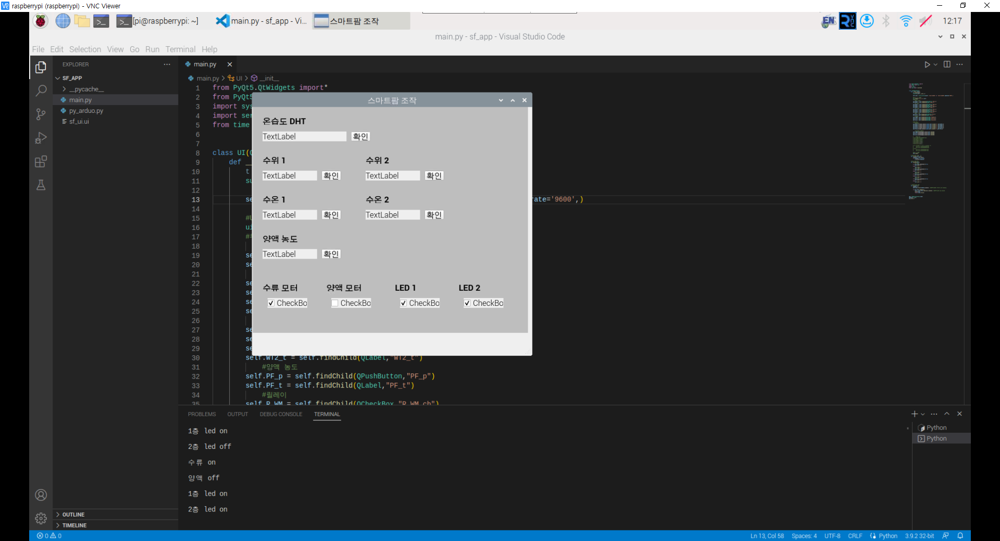
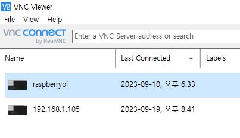
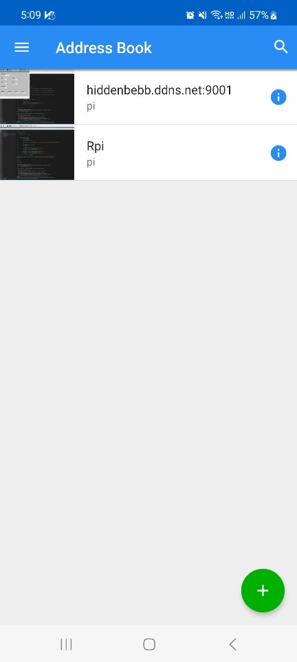
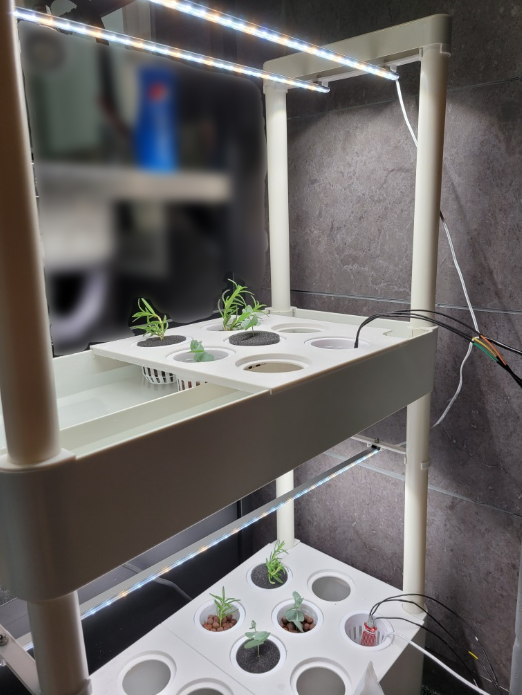
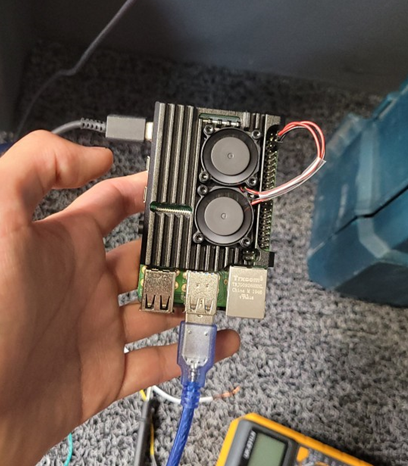
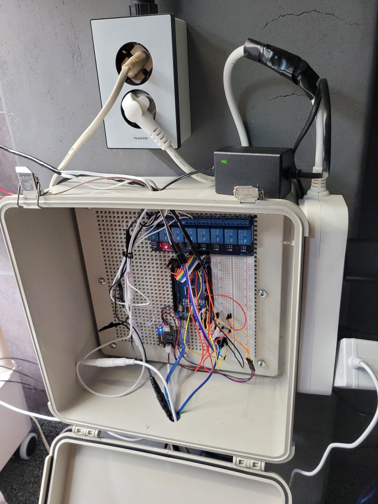
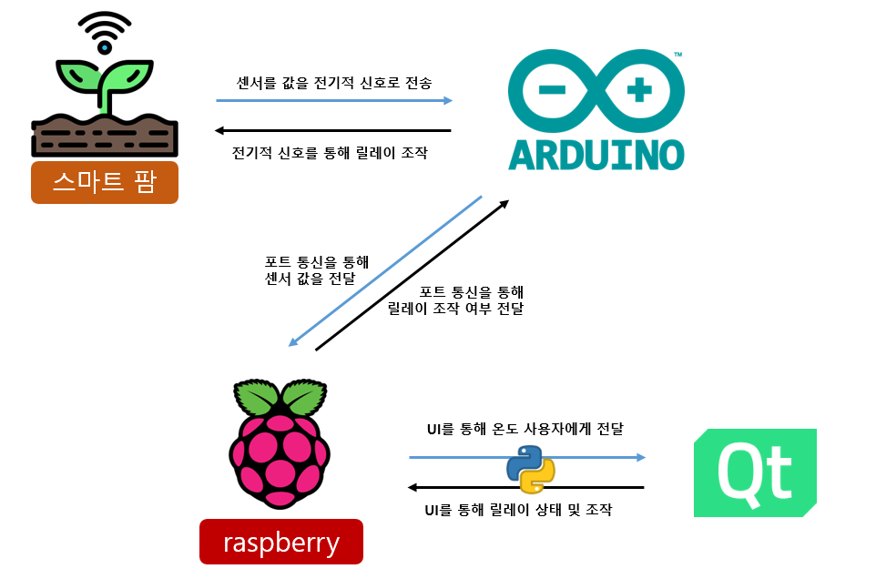

# 아두이노, 라즈베리파이를 이용한 스마트 팜 제작

🌱 [**코드 이외 제작 과정 보기**](https://blog.naver.com/bongjooncha/223132248497)

### **목차** 

[1. 프로젝트 소개](#1-프로젝트-소개) 
[2. 프로젝트 사용 도구](#2-프로젝트-사용-도구) 
[3. 프로젝트 기능 소개 ](#3-프로젝트-기능-설명) 
[4. 프로젝트 구조](#4-프로젝트-구조) 

 

## 1. 프로젝트 소개

### **스마트팜 제작** 

#### 일반 가정용 실내 스마트팜 제조기에 아두이노를 이용해 센서의 값을 받아오고 릴레이를 통해 전등 조작 가능하게 제작. 이후 라즈베리파이에 연결하여 무선으로 조작.

| 차별화 기능 1 | 디지털 신호를 통해 아날로그 값을 받아옴                 |
| ------------- | ------------------------------------------------------- |
| 차별화 기능 2 | VNC(가상 네트워크 컴퓨팅)을 통해 원격으로 스마트팜 제어 |

 

## 2. 프로젝트 사용 도구

### 사용 도구 및 데이터  

- Device  
  
  

- software  
  

- UI  
  

 

## 3. 프로젝트 기능 설명

<table>
  <thead>
    <tr>
      <th>1. 사용된 센서 및 모듈</th>
    </tr>
  </thead>
  <tbody>
    <tr  style="font-size:12px">
      <td>방수형 온도센서 x2 / DHT22 온습도 센서 x1 / 워터라벨 수위센서 x2 / 릴레이 모듈 x4/
      TDS 수질 양액 농도 측정 모듈 x1
      </td>
    </tr>
  </tbody>
</table>

<table>
  <thead>
    <tr>
      <th>2. 스마트팜 조작 UI</th>
    </tr>
  </thead>
  <tbody>
    <tr style="font-size:12px">
      <td>실내 온습도, 수위, 수온, 양액 농도를 확인 할 수 있습니다. 그리고 수류 모터, 양액 모터, led를 조작 할 수 있습니다. 라즈베리 파이를 통해 아두이노와 연결되어 작동하는 소프트웨어이며, QT5를 이용해서 제작되었습니다.</td>
    </tr>
    <tr>
      <td></td>
    </tr>
  </tbody>
</table>

<table>
  <thead>
    <tr>
      <th>3. 라즈베리파이와의 통신</th>
      <th></th>
    </tr>
  </thead>
  <tbody>
    <tr style="font-size:12px">
      <td>가정에서 사용하는 공유기의 9001번의 공인포트 포트를 통해 라즈베리 파이와 소통할 수 있게 22번 사설포트와 고정했습니다. 이때 보안을 위해 지정된 MAC주소를 가진 디바이스를 통해서만 통신할 수 있게 설정했습니다.</td>
    </tr>
    <tr>
      <td>
        

      </td>
      <td>
        
      </td>
    </tr>
  </tbody>
</table>

<table>
  <thead>
    <tr>
      <th>4. 스마트팜 사진</th>
      <th></th>
      <th></th>
    </tr>
  </thead>
  <tbody>
    <tr style="font-size:12px">
      <td>스마트 팜</td>
      <td>라즈베리 파이</td>
      <td>아두이노</td>
    </tr>
    <tr>
      <td></td>
      <td></td>
      <td></td>
    </tr>
  </tbody>
</table>

 

## 4. 프로젝트 구조

 
